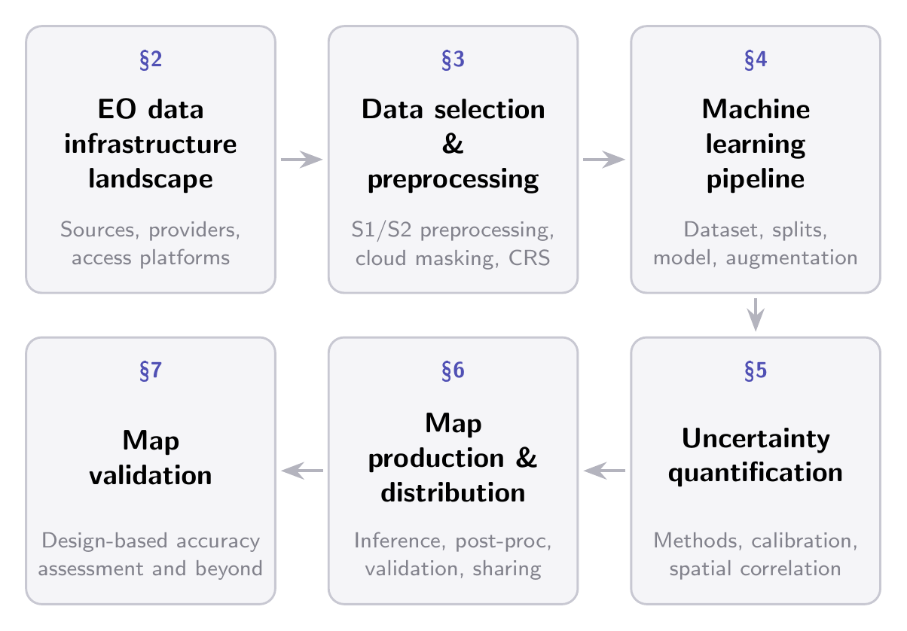

In this section, we focus on accessing EO data products. The access landscape has expanded significantly in recent years, but it is also fast-moving and not cleanly delineated: providers and platforms regularly restructure their offerings, pricing, and access policies, and the boundaries between "canonical provider", "cloud re-distributor", and "compute platform" are increasingly blurred. A unifying constraint across this landscape is *data gravity*: modern EO archives have grown to a scale where even freely available data is often impractical to move, and the position of compute relative to data has become a primary design factor. This is the underlying reason most large-scale EO workflows today rely on platforms that co-locate data and compute rather than directly downloading from canonical providers. Figure @fig-eo-data-access provides an overview of the resulting access landscape.

{#fig-eo-data-access}

**Canonical EO data providers** maintain authoritative archives of specific satellite missions and datasets. The Copernicus Data Space Ecosystem (CDSE) serves as the primary distribution point for Sentinel missions and related European products. The United States Geological Survey (USGS) provides access to Landsat observations. NASA Earthdata hosts MODIS, GEDI, ICESat-2, and other NASA Earth science products. The European Organisation for the Exploitation of Meteorological Satellites (EUMETSAT) distributes data from MSG, MTG, Sentinel-3, Sentinel-6, and related systems. Additional canonical providers include the JAXA Earth Observation Center for ALOS PALSAR, DLR Geoservice for TanDEM-X, and various other agencies maintaining specialized datasets on dedicated platforms.

**Re-distribution platforms** have emerged to simplify this access, though their roles vary considerably. Google Earth Engine (GEE) [@gorelick2017google] is best understood as a compute ecosystem with co-located data rather than a pure data provider. Access is primarily through server-side operations and the platform is highly effective for tasks that exploit this paradigm, including extracting moderate-scale ML training datasets, a common use in the community. However, large-scale data extraction is not what GEE is built for, and users quickly run into export quotas and rate limits. Furthermore, non-commercial quota tiers^[<https://perma.cc/2Q5W-2RUN>] were recently introduced. Microsoft Planetary Computer (MPC), by contrast, is essentially a data access layer: a STAC catalog of cloud-hosted Cloud-Optimized GeoTIFFs (COGs) in Azure Blob Storage, with no built-in server-side processing since the retirement of its free compute environment in mid-2024^[<https://github.com/microsoft/PlanetaryComputer/discussions/347>.] Amazon Web Services (AWS) Simple Storage Service (S3) hosts both free buckets (straightforward access) and requester-pays buckets (imposing transfer costs on the user) containing EO data. Additional platforms include Source Cooperative, SentinelHub, Google Cloud Storage public datasets, and CloudFerro^[CloudFerro also acts as a canonical EO data provider, as the CDSE cloud provider.]. 

**Provider** | **Host** | **Online operations** | **Large-scale egress** | **Large-scale cloud compute collocation** |
| --- | --- | --- | --- | --- |

: Overview of major Earth observation data providers. **Host**: cloud infrastructure where the data resides, with geographic region when documented. **Online operations**: whether server-side processing such as multi-scene compositing or cloud-masking is exposed through an API. **Large-scale egress**: feasibility of bulk archive download, ✓ = supported on the standard tier modulo cloud egress costs; $\approx$ = requires commercial or institutional arrangements beyond standard egress; × = the access API is not architecturally suited to bulk download regardless of budget. **Large-scale cloud compute collocation**: feasibility of running very large workloads such as deep learning inference at planetary resolution on infrastructure adjacent to the data, ✓ = the data resides on a hyperscaler (AWS, Azure, or Google Cloud Platform) offering large GPU/TPU pools in the same region; $\approx$ = compute is available on the underlying infrastructure but does not reach hyperscaler scale, or the path between data and compute is interrupted by mandatory exports. \ *GEE data is not directly user-accessible at the storage layer; access requires the GEE platform's own constrained compute environment. {#tbl-eo-providers}

Relying on re-distribution platforms introduces several trade-offs. Since these platforms ingest data from canonical EO providers, there may be latency between acquisition and availability, and their processing pipelines may differ from those of the original providers. As an example, we provide an overview of the processing differences between the native Sentinel-1/2 data products and their GEE equivalents in [Sentinel-2 Processing](appendix_processing_pathways.qmd#sentinel-2). Data gaps can also occur, as regularly reported by users on the MPC [GitHub repository](https://github.com/microsoft/PlanetaryComputer/issues).

Accessing EO data therefore involves practical choices across multiple dimensions. Each platform offers distinct trade-offs in where the data is hosted, support for server-side operations, suitability for large-scale download, and feasibility of running large-scale collocated compute --- we summarize them in Table @tbl-eo-providers. Most providers have converged on STAC as a catalog standard and the S3 protocol as a download mechanism, but they differ in whether they support online operations such as compositing, in their suitability for large-scale downloads, and in whether the underlying infrastructure can host hyperscaler-class compute alongside the data. 

A practical pattern that follows from data gravity is to treat EO data access as a two-stage process. *Model development* typically involves modest data volumes that can be downloaded comfortably from almost any provider; here, convenience and catalog coverage dominate the choice. *Inference at scale*, on the other hand, is dominated by data movement: pulling petabyte-scale imagery from one provider into a different compute environment is rarely tractable. As a result, practitioners typically either (i) co-locate inference compute with the data, or (ii) accept the time and storage cost of moving the EO data into their compute environment. In the first case, this means inference at the largest scales is feasible only where the data lives on a hyperscaler (AWS, Azure, or GCP) with large GPU/TPU pools available in the same region, which the rightmost column of Table @tbl-eo-providers reflects. The platform that minimizes friction for training is therefore often not the one that minimizes cost for inference. No universally optimal solution exists: the most appropriate choice depends on the scale of analysis, computational requirements, institutional constraints, and the acceptable trade-off between immediate convenience and the risk of lock-in to proprietary platforms.

 The choice of data source and access pathway establishes the starting point of the pipeline. The next section turns to the practical challenges of selecting and processing these satellite observations, to make them suitable for ML workflows and map generation.
