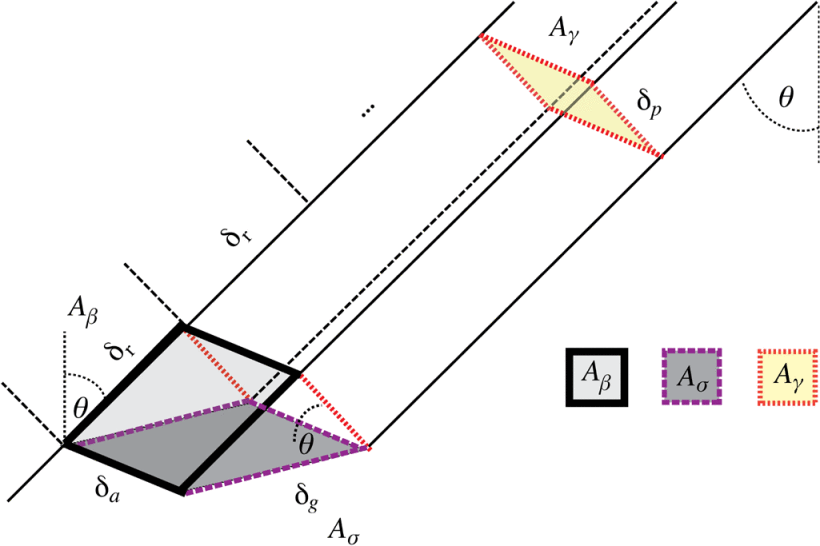

This appendix expands on the radiometric processing chain summarized in Section [Data Preprocessing](data_preprocessing.qmd), focusing on the choice of backscatter convention and the role of terrain in radiometric normalization, following the taxonomy of @Small2011. 

### From digital numbers to calibrated backscatter SAR backscatter is recorded in phase, used to determine the distance to a target, and amplitude, indicating the amount of signal returning to the sensor. Intensity is calculated from the phase and amplitude and stored as digital numbers (DN). Radiometric calibration converts DN to a physically meaningful backscatter coefficient by normalizing by a reference area to obtain backscatter per unit area. The simplest calibrated quantity is the radar brightness $\beta^0$, defined as the calibrated intensity divided by the slant-range pixel area $A_\beta$ (see Figure @fig-backscatter). Because $\beta^0$ assumes no Earth model, it is a property of the radar measurement alone and forms the conceptual root from which all other conventions are derived [@Raney1994].

{#fig-backscatter}

The conventional backscatter coefficient $\sigma^0_E$ normalizes by the ground-range area $A_{\sigma}$, giving $\sigma^0_E = \beta^0 \cdot \sin\theta_E$, where $\theta_E$ is the incidence angle with respect to the ellipsoid. The $\gamma^0_E$ convention divides by the area perpendicular to the line of sight $A_\gamma$, giving $\gamma^0_E = \beta^0 \cdot \tan\theta_E$. Note that a model of the Earth is required to gain knowledge of the incident angle $\theta_E$ to calculate $\sigma^0$ or $\gamma^0$.

### The problem with the ellipsoid assumption None of $\beta^0$, $\sigma^0_E$, or $\gamma^0_E$ accounts for local relief: the areas they normalize by are derived from the ellipsoid, but the true illuminated area of a pixel depends on the terrain. A slope tilted toward the sensor exposes more surface area than the ellipsoid assumes and therefore appears brighter; a slope tilted away exposes less and appears darker. Pixel intensity becomes partly a function of topography rather than ground properties, biasing any task that compares backscatter across relief: land cover classification, biomass retrieval, change detection, or the mosaicking of ascending and descending passes.

### Terrain-referenced conventions Radiometric terrain correction (RTC) replaces the ellipsoid-derived reference area with one computed from a digital elevation model (DEM). Two terrain-referenced conventions are in common use. The $\sigma^0_T$ convention applies a per-pixel scalar correction based on the local incidence angle (LIM), $\sigma^0_T = \sigma^0_E \cdot \sin\theta_{\text{LIM}}/\sin\theta_E$, where $\theta_{\text{LIM}}$ is derived from the DEM. This correction assumes that a single planar facet contributes to each pixel and only adjusts for its tilt. @Small2011 argues that such angle-based normalizations are flawed due to their failure to account for many important properties of radar backscatter in regions with significant topographic variation. They introduced the $\gamma^0_T$ convention that instead integrates the illuminated facet areas rigorously over the DEM, accumulating contributions from all terrain facets that map to a given SAR pixel. This handles cases of steep or complex relief where multiple facets contribute per pixel, which a local-angle scalar correction cannot represent. $\gamma^0_T$ is therefore preferred over $\sigma^0_T$ whenever significant relief is present, and is the default terrain-flattened output of modern processors, such as ESA SNAP [@esasnap]. 

### Relationship to geometric terrain correction Radiometric terrain correction is distinct from geometric terrain correction (GTC), which uses a DEM and the Range-Doppler algorithm to relocate pixels from radar coordinates to map coordinates. GTC corrects *where* pixels sit; RTC corrects *what their values mean*. The two operations share the same geometric mapping between SAR and DEM coordinates and are typically computed together, but they are conceptually independent: an image can be geometrically correct while remaining radiometrically biased on slopes, and backscatter can be terrain-flattened in radar geometry before being geocoded. GTC alone is adequate for visual interpretation over relatively flat terrain; quantitative analysis across significant relief generally requires both corrections, with $\gamma^0_T$ as the natural input convention for any downstream task that compares backscatter across topographically varied scenes.
