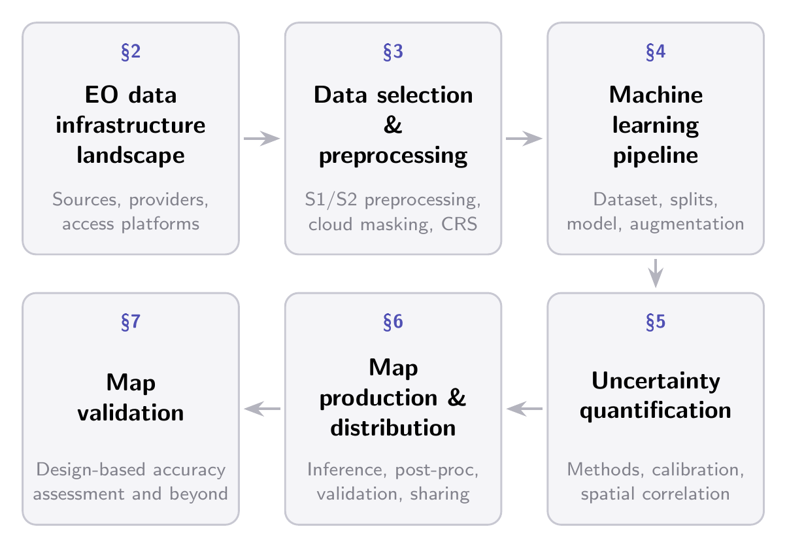

The past decade has seen a rapid expansion in the production of large-scale geospatial products derived from Earth observation (EO) data using machine learning (ML). This website presents an end-to-end account of the best practices, challenges, and common pitfalls that span the entire pipeline from raw satellite data to a published, validated map product.

We organize the discussion around six interconnected themes which trace the pipeline from the EO data landscape and preprocessing, through ML-specific stages of dataset construction, model design, and training, to uncertainty quantification, map generation, dissemination, and validation.

{#fig-overview}

## Main Sections {.unnumbered}

**Overview of the EO data infrastructure landscape** — Satellite missions, data access platforms, and the practical trade-offs of working with petabyte-scale archives.

**Data selection and preprocessing** — Temporal strategies, cloud masking, SAR preprocessing, and the hidden choices that shape the training signal.

**ML dataset construction and model training** — Data formats, spatial splitting, gridding, model design, and training considerations specific to EO.

**Uncertainty quantification** — Sources of uncertainty, quantification methods, calibration diagnostics, and how to operationalize uncertainty in map products.

**Map production and distribution** — Tiled inference at scale, artifact mitigation, post-processing, and cloud-native dissemination.

**Validation** — Design-based accuracy assessment, the distinction between model evaluation and map validation, and reporting standards.

::: {.callout-note appearance="minimal" icon="false"}
© 2026 IEEE. Personal use of this material is permitted. Permission from IEEE must be obtained for all other uses, in any current or future media, including reprinting/republishing this material for advertising or promotional purposes, creating new collective works, for resale or redistribution to servers or lists, or reuse of any copyrighted component of this work in other works.
:::
