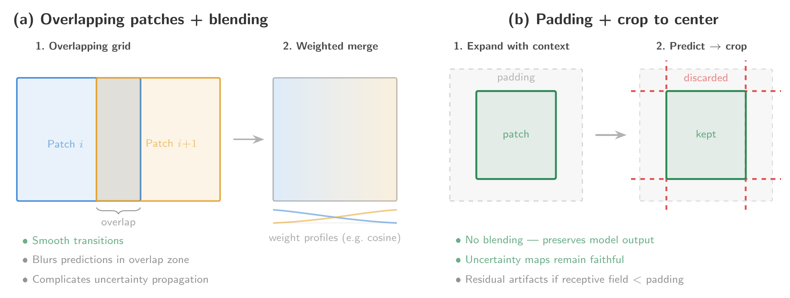

Generating wall-to-wall predictions over large geographic extents requires processing thousands of satellite scenes through the trained model, a task that is both computationally intensive and logistically complex. Two aspects of this process warrant particular attention: the choice of compute infrastructure, which determines how the workload is distributed and scaled, and the treatment of spatial artifacts that emerge as a byproduct of tiled inference.

## Compute environments

The computational strategy for large-scale EO/ML mapping is primarily dictated by the relationship between data volume and processing power. We distinguish between two primary regimes: local high-performance computing (HPC) and cloud-native environments. The decision of where to execute inference therefore involves a fundamental trade-off between bandwidth, cost, and architectural flexibility. 

### **Data-to-Compute**

This regime is most attractive to researchers with access to subsidized or institutional clusters, where the compute itself comes at little to no direct cost. Most major EO platforms (MPC, AWS Open Data, CDSE) do not charge egress fees, but the transfer is bounded by network bandwidth and provider-side rate limits, which can make the ingestion phase a significant bottleneck for global-scale mapping campaigns involving tens of thousands of satellite scenes. A compounding factor is the physical distance between the cluster and the data provider. Most EO platforms serve data from a single cloud region (e.g., `us-west-2` for NASA Earthdata, `eu-central-1` for the Sentinel archives on AWS, West Europe for Microsoft Planetary Computer, Warsaw for CDSE), so a researcher downloading from a different continent pays a steep latency penalty on every network request compared to an in-region client. Content Delivery Networks (CDNs) solve this by caching data on geographically distributed edge nodes, but none of the major EO data providers currently distribute data through a CDN. HuggingFace, which hosts a growing number of EO/ML datasets, is a notable exception owing to its use of CloudFront.

Once the data reaches the local infrastructure, further challenges arise. Storing the full dataset locally can be prohibitive at petabyte scale, and institutional clusters typically separate storage nodes from the high-throughput compute nodes where GPU or CPU inference is executed. This means that data sitting on a storage node must be read across an internal network at inference time, introducing an additional I/O bottleneck that can stall the pipeline. One way to sidestep the storage layer entirely is to stream the data directly to the compute nodes during inference, which avoids both the storage capacity constraint and the inter-node transfer overhead. Streaming comes with its own drawback, however: if multiple passes over the same scenes are required, each pass triggers a fresh download, effectively multiplying the external transfer burden and the geographic penalty described above. 

### **Compute-to-Data**

When data volumes, rate limits, or transfer times make the previous regime impractical, the alternative is to provision compute next to the data. The model is deployed within the same cloud ecosystem where the EO data already resides (e.g., AWS, MPC, CloudFerro). This neatly eliminates the data transfer penalty that plagues institutional clusters, but only if compute and data are genuinely colocated in the same cloud region. Cloud providers offer compute resources across dozens of regions worldwide, and it is the researcher's responsibility to provision instances in the region where the EO data is actually stored. Launching compute in the wrong region silently reintroduces the same cross-continental latencies discussed above, compounded by inter-region egress fees. When colocation is correctly configured, however, read latencies drop to those of an internal network call, making this regime ideal for I/O-bound inference workloads. An inherent limitation is that the usable data pool is restricted to what the chosen platform hosts, both in terms of data sources and processing baselines: researchers cannot easily mix data from different providers and must accept the specific preprocessing version available on the platform.

The dominant concern here is the price of compute itself. Costs can escalate quickly, particularly when heavy preprocessing must be performed at inference time rather than being precomputed, which has led some researchers [@feng2025tessera; @Van_Tricht_2023] to restrict their inference pipelines to CPU-only execution. Spot or preemptible instances offer substantial discounts but are subject to reclamation by the provider at any time, which means that inference jobs can be interrupted mid-execution. Running reliably on spot instances therefore requires a checkpoint-and-resume pipeline capable of recovering gracefully from preemption, along with orchestration tooling such as Kubernetes, Ray, or Flyte to manage job scheduling and restarts. Cost pressures also extend well beyond inference itself: downloading the resulting predictions incurs egress fees. Even their long-term storage on the cloud incurs recurring fees for both storage and egress (either on the user side or creator side), costs that persist well after the project ends and can become difficult to sustain. More economical alternatives exist and are discussed in Section [Sharing](sharing.qmd).

## Mitigation of artifacts 

Due to the significant memory constraints of modern ML architectures, EO scenes cannot be processed in their entirety. Instead, they are partitioned into a grid of smaller patches for inference. However, many models exhibit a spatial bias: predictive confidence tends to be highest near the center of a patch and degrades toward the borders. When these individually processed patches are reassembled into a final output, this bias manifests as patch artifacts---unnatural discontinuities or "seams" along the patch boundaries.
This spatial bias is a consequence of translational variance in neural networks, arising in convolutional architectures primarily from zero-padding and non-unary strides [@huang2018tiling; @zhang2019making; @kayhan2020translation], and in vision transformers from patch embedding, positional encodings, and windowed attention [@rojasgomez2023making]. Architectural remedies exist [@zhang2019making; @kayhan2020translation], but are rarely adopted in large-scale EO inference, where translational variance remains a practical concern. To mitigate the resulting artifacts at inference time, researchers typically employ one of two strategies, illustrated in Figure @fig-inference-tiling.

{#fig-inference-tiling}

### Overlapping patches and blending

The first strategy defines an inference grid with overlapping patches, ensuring that boundary pixels receive multiple predictions. These redundant outputs are then merged using a weighted average based on each pixel's spatial distance from its respective patch center, as in [@Neumann_2025; @pauls2026echosat; @herzog2025olmoearthstable]. Common weighting functions (e.g., 2D Gaussian kernels, cosine tapers, or linear ramps) prioritize the more reliable central predictions. In regression tasks, this aggregation is performed directly in the continuous output space; for classification, it is typically applied to the raw class probabilities. While effective at smoothing transitions between patches, this blending can subtly shift individual pixel predictions and demands careful treatment of predictive uncertainty.

A naive approach to propagating uncertainty through the averaging step is to compute the weighted average of the predicted variances alongside the weighted average of the means. This ignores the disagreement between overlapping predictions, which is itself a source of uncertainty. The correct combined variance follows the law of total variance:

$$
\sigma^2_{\text{combined}} = \sum_i w_i \sigma_i^2 + \sum_i w_i(\mu_i - \bar{\mu})^2,
$$

where the first term is the weighted mean of the individual variances and the second captures the spread between overlapping point estimates. Omitting the second term underestimates uncertainty at locations where overlapping patches disagree, which would typically be near land cover boundaries and abrupt transitions where reliable uncertainty matters most. This correction requires no additional model calls and is straightforward to implement. It does not fully account for the correlation between overlapping predictions, which share most of their input context, but is strictly preferable to naive variance averaging and captures the dominant source of error.

### Padding and cropping

The second strategy uses padding to provide the model with broader spatial context for every pixel. Each patch is expanded with neighboring pixel data (or a specialized padding scheme at scene boundaries) during inference. After the forward pass, predictions are cropped back to the original patch dimensions, discarding the less reliable border outputs. This is the approach followed by [@brown2025alphaearthfoundations; @Pasquarella2023; @pauls2024estimating]. Because it retains only those predictions made with a full spatial context, this method is considered more faithful to the model's internal learned representations and avoids algebraically blending distinct predictions. However, residual artifacts may persist if the model's effective receptive field or the chosen padding margin does not fully encompass the boundary region affected by translational variance.

Ultimately, the choice between these strategies must be determined on a case-by-case basis, balancing the need for predictive fidelity with the requirement for spatial continuity. Beyond patch-level inference, these techniques are equally critical for mitigating tiling artifacts, larger-scale discontinuities that arise when the Earth is partitioned into standard geospatial tiles (e.g., UTM zones or Sentinel-2 tiles). Selecting the optimal approach ensures that the resulting data products remain suitable for high-precision downstream analysis.
