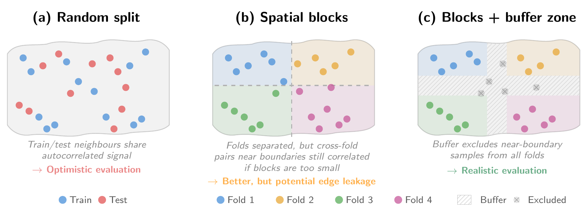

Constructing an ML-ready dataset from EO imagery introduces challenges that have no direct analogue in standard computer vision: spatial autocorrelation in the labels inflates apparent performance [@Ploton2020-ub; @Kattenborn2022] if not handled at the splitting stage, geographic bias in the sampling distorts what the model learns, and the choice of tiling and gridding scheme can silently introduce data leakage or duplication. We address these issues in turn, starting with the data formats that underpin the entire dataset design.

## Data formats {#sec-data-formats}

The data format used to store an ML-ready dataset is a *creation time* decision that propagates through the entire pipeline. It defines how array payloads are physically laid out, how metadata are encoded, how chunks or tiles are addressed, and which codec is required to decode the data. These choices are not strictly irreversible, but changing them requires repacking, rechunking, or rewriting the dataset, and they should therefore be treated as part of the dataset design rather than as a late implementation detail. The most important consequence of a format choice is the efficiency of the access pattern. The optimal layout minimizes *over-read*, understood as the gap between bytes fetched from storage and bytes actually used by the model. In practice, this depends on how well the physical layout matches the logical access pattern of training, including the shape of the chunks, the band interleaving strategy, the compression block size, the placement of metadata, and the latency of the storage backend. Most formats used for ML on EO data can be understood through two broad storage patterns.

### Container formats with an internal index

The first pattern stores data inside *binary containers*, each with its own internal metadata and offset structures. A dataset may consist of a single such file or a collection of them. HDF5 [@folk1999hdf5], NetCDF4 [@rew1990netcdf], GeoTIFF [@ogc_geotiff], and the Cloud Optimized GeoTIFF (COG,  @ogc_cog) belong to this family. HDF5 organises data as hierarchical groups and arrays, with metadata describing dimensionality, datatype, layout, and filters. Each array is stored either contiguously, as a single block of bytes, or split into fixed size multidimensional chunks that are addressed independently and compressed separately. NetCDF4 builds on HDF5 while imposing the netCDF data model of named variables, dimensions, and attributes. The Climate and Forecast (CF, @hassell2017cf) conventions associated with NetCDF are a separate specification that defines standard names, units, and coordinate axes so that datasets from different sources can be compared without ad hoc translation. GeoTIFF extends TIFF with geospatial keys for regularly gridded raster imagery defined by an affine matrix and, unlike the formats above, it requires the data to lie on a regular spatial grid. The COG is a profile of GeoTIFF that constrains its *create options* for efficient spatial partial reads, requiring tiled image data, all metadata at the start of the file, and internal reduced resolution *overviews*. All formats in this family share two practical considerations. The first is the order in which array values are serialised, called the *interleave*, which fixes which neighbours end up physically adjacent in the file and therefore which reads are cheap. The second is the cost of opening the file. The internal index of offsets and byte lengths must be fetched before any data can be addressed, but once that index sits in memory, reads to individual chunks are independent and parallel by design.

### Key value chunk stores
The second pattern stores arrays as independently addressable chunks in a key value store. Zarr [@miles2020zarr] is the canonical example. A Zarr hierarchy contains metadata documents for groups and arrays, while each encoded chunk is stored under a key in an abstract store, which may be implemented as a directory on a filesystem (as objects in cloud storage) or through any backend exposing equivalent read and write operations. This removes the need to open a single monolithic container before locating chunk data, since the storage keys themselves provide the addressing mechanism, which aligns naturally with distributed readers and parallel workloads. The trade off is that a naive Zarr layout can create very large numbers of small files or objects, which stresses POSIX metadata operations and inode limits, or inflates object storage request overhead. The Zarr v3 sharding extension (ZEP2) addresses this by packing multiple logical chunks into a larger physical storage object while preserving chunk level access. Zarr alone defines array storage, chunking, codecs, and metadata containers. However, it does not define the geospatial meaning of coordinates, CRS, affine transforms, or multiscale pyramids, which GeoZarr and related conventions are emerging to address.

**Format** | **Storage model** | **Typical payload** | **Random access mechanism** | **Geospatial metadata** |
| --- | --- | --- | --- | --- |
| NetCDF4 | NetCDF data model on an HDF5 backend | N dimensional variables with named dimensions, attributes, and groups | HDF5 chunking through the netCDF API | Usually via CF conventions |
| GeoTIFF | TIFF image container extended with GeoTIFF keys | Regular gridded raster imagery, usually 2D with bands | Strips or tiles, efficient spatial access requires tiling | Built in through GeoTIFF tags and keys |
| COG | GeoTIFF organised for partial reads and overviews | Cloud distributed geospatial rasters and image scenes | Tile offsets and range requests, overviews reduce full scene reads | Built in through GeoTIFF keys |
| Zarr | Key value hierarchy of metadata documents and encoded chunks | Chunked N dimensional arrays for cloud or distributed processing | Direct key lookup for chunks, v3 sharding can group chunks into larger objects | Via emerging GeoZarr or other domain conventions |

: Storage layout and practical properties of data formats relevant for AI4EO datasets. {#tbl-data-formats}

These two patterns are often compared by raw performance, but with equivalent *create options* on similar workloads, both deliver comparable read speed. Statements such as "HDF5 does not support parallel writes" or "COG is faster than Zarr" are typically claims about implementations rather than about formats. Format selection should therefore weigh the specification and the maturity of its tooling.

Recent additions to this tooling target practical bottlenecks in dataset generation, storage, and access. For instance, `Rasteret` [@rasteret] caches COG headers in a GeoParquet index and reads pixels without GDAL, removing the repeated header parsing that dominates cold-start cost in ML pipelines. `hdf5plugin` [@hdf5plugin] adds HDF5 compression filters, `Dask` [@dask] parallelises processing, and `xarrayvideo` [@xarrayvideo] stores spatiotemporal xarray datasets as videos to save space.

All of the above operate at the array level and leave the organisation of an ML-ready dataset itself unspecified, including splits, modalities, and sample-level metadata. Emerging specifications such as TACO [@taco], currently under active development, aim to fill this gap by defining a structure tree and metadata schema over standard containers, giving the dataset a portable contract that is independent of the underlying array format.

## Dataset splits {#sec-dataset-splits}

When evaluating the performance of a ML model, we want to avoid over-confident results. A conventional uniformly at random assignment of data samples to training and test sets can bias the evaluation if labels are spatially auto-correlated and clustered [@rolf2024mission]. A widely spread approach to tackle spatial autocorrelation is to perform block cross-validation, which @Roberts2017 recommends using "wherever dependence structures exist in a dataset, even if no correlation structure is visible in the fitted model residuals, or if the fitted models account for such correlations". Spatial $K$-fold block cross-validation first divides the area into non-overlapping spatial blocks of a certain size, before assigning each block to one of $K$ folds. Model training and evaluation are then performed using the leave one-out method, where samples from a single fold are set aside for model evaluation, while samples from the remaining $K-1$ folds are used for model training, and the process is repeated for each fold, as in [@Mosig2026; @Lusk_2026]. Alternatively, one fold can be assigned for model evaluation, one fold for validation, and the $K-2$ others for training, as in [@garnot2021panoptic]. Results are then reported across the concatenated test folds. In order to avoid cross-fold contamination, a good practice consists in enforcing spatial buffers between blocks, as in [@garnot2021panoptic]. Buffers and block size address the same underlying issue and are partially substitutable: sufficiently large blocks reduce edge leakage to negligible levels without explicit buffers [@Roberts2017], while buffers are most useful when block size is constrained by study extent or sample distribution. We illustrate those different approaches in Figure @fig-splits. While spatial block cross-validation provides a reliable assessment of model generalizability, most works perform a more limited spatial block validation equivalent to setting $K=1$, in which blocks are partitioned once and randomly assigned to train, validation, and test sets [@Neumann_2025; @herzog2025olmoearthstable; @kerner2025fields; @pauls2024estimating]. The definition of a block varies across works. Some impose a regular grid (@Mosig2026 grid the Earth into non-overlapping blocks of 50km in equal area projection) while others adopt the geographical unit at which the data is delivered, such as Sentinel-2 tiles [@lang2023canopyheight] or Planet quads [@herzog2025olmoearthstable; @glazer2025tempo]. @Lusk_2026 take a more principled approach, determining the spatial autocorrelation via semivariograms at a $1\text{km}^2$ resolution and defining hexagonal blocks accordingly. The appropriate block size depends on the spatial scale of residual autocorrelation: blocks should be substantially larger than the distance at which model residuals become uncorrelated, since smaller blocks leave train and test samples near boundaries effectively dependent [@Roberts2017]. We elaborate on various gridding choices and their implications in the next section.

{#fig-splits}

While we have focused on spatial blocking, the underlying principle generalizes to any source of dependence in the data: folds must be independent along whatever structure the model is expected to extrapolate across. Extensions include phylogenetic blocking for taxonomic relatedness [@Revell2010], temporal blocking for serial autocorrelation [@Bergmeir2012], and blocking in environmental or feature space, which tests generalization to novel conditions rather than novel locations [@meyer2021areaofapplicability]. The appropriate choice depends on what form of generalization the evaluation is meant to characterize. 

Furthermore, in the case of geographically distributed labeled data, it might be of interest to evaluate the performance of the model for different regions, by defining individual splits for each region, as in [@kerner2025fields]. This also enables the assessment of a model's geographical generalization abilities in a comprehensive manner: any region can be held out from the training set and be evaluated on, as in [@butsko2025deploying].

  The spatial blocks used for splitting must be defined on a grid, and this choice is not neutral. It interacts with the projection of the map, the spatial distribution of the samples, and the granularity of the split. 

## Spatial gridding {#sec-grid}

A grid defines the spatial index over which data is catalogued, sampled, and split. Table @tbl-grid-comparison compares candidate grids across conformality, global continuity (i.e. no seams or inter-zone overlaps) and whether they are area-preserving. A grid is *equal-area* (or area-preserving) if every cell (or pixel) represents the same ground area, and *conformal* if it preserves local angles and shapes (so that a square pixel corresponds to a square patch on the ground). We group candidate grids into four families, which we now describe.

**Grid** | **Equal-area** | **Conformal** | **Globally continuous** |
| --- | --- | --- | --- |
| Plate carrée | × | × | ✓ |
| Web Mercator | × | ✓ | ✓$^a$ |
| UTM / MGRS | ×, ✓📍 | ×, ✓📍 | × |
| Equi7 Grid | $\approx$ | × | ×$^b$ |
| S2 Geometry | $\approx$ | × | ✓ |
| H3 | $\approx$ | × | ✓ |
| HEALPix | ✓ | × | ✓ |
| Major TOM | $\approx$c | n/a$^d$ | ✓ |
| Equal Earth grid | ✓ | × | ×$^e$ |

: Comparison of candidate grids for global EO dataset construction. *Globally continuous* indicates that the grid tiles the entire sphere with each point assigned to a uniquely defined cell and well-defined adjacency across all cell boundaries. $\approx$ \ indicates that the property holds approximately but not exactly. 📍 The property holds locally within a single UTM zone, not globally.   $^a$ Clips at $\pm85\degree$ latitude.   $^b$ Continental boundaries have 50 km overlap.   $^c$ Via implicit Voronoi tessellation of sample points.   $^d$ Point-based grid; projection not prescribed.   e Grid cells do not align cleanly across the antimeridian. {#tbl-grid-comparison}

### Geographic grids Geographic grids partition the sphere directly by lines of constant latitude and longitude, without applying any map projection. The simplest instance is plate carrée: cells of fixed angular extent that are trivial to index but whose ground area scales with the cosine of the latitude. A $1\degree \times 1\degree$ cell covers approximately 12{,}400 km$^2$ at the equator and under 2000 km$^2$ at 80$\degree$ latitude, such that uniform sampling on this grid systematically oversamples high latitudes.
### Projection-based tilings Projection-based tilings lay a regular metric Cartesian grid over a planar coordinate system produced by a general-purpose cartographic projection. The grid's geometric properties (conformality, area preservation, global continuity) are inherited from the projection. Web Mercator (EPSG:3857) is the industry standard of $256\times256$ tiles used by web mapping platforms. It is conformal but not equal-area, with ground resolution varying by roughly a factor of six between the equator and $\pm60\degree$ latitude. UTM partitions the globe into 60 UTM zones of $6\degree$ width, each with a conformal transverse Mercator projection. MGRS [@NGA_SIG_0012_2014] subdivides each UTM zone by $\approx8\degree$ latitude bands into *grid zones*, each further divided into 100 km × 100 km squares. The Sentinel-2 tiling scheme, which inherits the UTM/MGRS framework, delivers products as 109.8 km x 109.8 km tiles, such that locations within the resulting  10 km border strips appear in two (or more) tiles [@BauerMarschallinger2023]. The Equi7 Grid [@BauerMarschallinger2014] uses seven continental sub-grids in Equidistant Azimuthal projections with a multi-level tiling structure (100 km $\times$ 100 km at level T1), offering a principled alternative to MGRS.
### Discrete Global Grid Systems (DGGS) Discrete Global Grid Systems are tessellations of the sphere designed to provide approximately or exactly equal-area cells with global continuity, avoiding the zone boundaries and overlaps of projection-based tilings. S2 Geometry [@veach2017s2] projects the sphere onto a cube and subdivides each face via a quadtree, yielding approximately equal-area quadrilateral cells (area ratio $\leq 2$ at any level). H3 [@h3] tiles the sphere in nested hexagons with similar distortion bounds. HEALPix [@Gorski2005] achieves exact equal-area pixelation of the sphere on iso-latitude rings; its rHEALPix variant [@Gibb2016] unfolds the tessellation onto a planar rectangle.
### Purpose-built EO grids Rather than adopting an existing cartographic standard, some grids have been designed specifically for the needs of EO dataset construction, prioritizing simplicity and compatibility with source imagery over formal geometric guarantees. Major TOM [@Francis2024MajorTOM] defines a set of approximately equidistant sampling *points* on the WGS84 ellipsoid, adapting longitudinal spacing to latitude so that high latitudes are not oversampled. It deliberately does not prescribe a projection or cell extent: the grid is an indexing layer, and patches are extracted in the source product's native CRS. A simpler alternative is to partition the projected plane of a global equal-area projection such as Equal Earth [@avri2018] (EPSG:8857) into regular cells; this gives exact equal-area stratification at the cost of shape distortion toward the poles and an antimeridian discontinuity.

## Data samples {#sec-gridtopatches}

With the data format, splitting strategy, and grid in place, the final step is to extract the actual samples used to train the model. We define a data sample as an $W\times H\times T \times C$ patch, where $W$ is the width, $H$ is the height, $T$ is the timestep, and $C$ is the number of channels (dimensionality of the EO data at hand). This process involves three considerations: the choice of projection, the sampling strategy, and the optional alignment of the various data modalities.

### Sampling strategy ML researchers typically need to extract EO data samples corresponding to a set of labeled points (or polygons) distributed non-uniformly. In label-scarce regimes, the classic approach is to extract a sample per label, a sampling design that inherits the geographic bias the labels might have. An alternative approach is to sample a certain number of samples per grid cell, keeping all labels in sparsely populated cells and subsampling in densely populated ones, preventing dense regions from dominating. The area that each cell represents impacts the sampling: if the cells have area variation (like S2/H3) or are latitude-distorted (plate carrée), this sampling implicitly gives smaller cells more samples per unit area. For the cap to correspond to a true "labels per $\text{km}^2$" ceiling, one can use equal-area grids (HEALPix) or weight by cell area. 

### Projection choice Most approaches [@Mosig2026; @feng2025tessera; @brown2025alphaearthfoundations; @Van_Tricht_2023; @lang2023canopyheight; @pauls2024estimating; @pauls2026echosat] keep the EO data in the native Coordinate Reference System (CRS) at which it is distributed. Others reproject the data to a single global CRS such as EPSG:3857 (Web Mercator) [@glazer2025tempo] or EPSG:4326 [@kerner2025fields], although this can introduce distortions. The native CRS at which Sentinel-2 data is distributed is UTM/WGS84, which is conformal and maintains near-constant spatial resolution: a pixel represents approximately $10\text{ m}\times 10\text{ m}$ on the ground everywhere within a zone [@Snyder1987], a property that could help the model learn consistent spatial features. In a projection that does not minimize distortion, the physical distance represented by one degree of longitude shrinks with latitude, which could degrade the model's ability to generalize across regions. If a single global CRS is required, an equal-area projection (e.g., Equal Earth, EPSG:8857) might be preferred, so that pixels represent the same amount of ground everywhere.

### Multimodal alignment When training patches combine data from multiple sensors (e.g., Sentinel-2 and ALOS-2 PALSAR-2), the inputs will generally differ in native projection, pixel spacing, and temporal sampling. The most common solution is to reproject and resample all modalities onto a shared grid and resolution before patch extraction, so that each training sample is aligned. This simplifies the data loader and model architecture but forces a choice of target resolution. The choice of resampling kernel also interacts with the downstream task: nearest-neighbor preserves categorical or integer-valued layers but introduces blocky patterns, whereas smooth kernels suit continuous fields but blur edges. An alternative is to preserve each modality at its native resolution and delegate alignment to the model architecture (Section [Model Design and Training](model_design_training.qmd)), avoiding information loss at the cost of greater architectural complexity.

Taken together, these considerations argue for decoupling two concepts that are often conflated: the indexing strategy (how to select samples) and the patch projection (the coordinate system each sample lives in). Indexing should be done on a global grid that minimizes over-/under-sampling and overlap, independently of the patch projection and of how the EO data is tiled. Operations that rely on geography, such as train/test splitting, should be done on this grid. The patch projection, by contrast, only needs to minimize distortion at the scale of a single patch. UTM/WGS84, for instance, is a natural choice when the source archive is already UTM-native.

  The construction of the dataset defines the information that the model will see during training. But a well-constructed dataset is a necessary condition, not a sufficient one. The next question is how to design a model architecture and training procedure that can translate this information into accurate predictions at the scale of the entire globe, within practical computational budgets.
