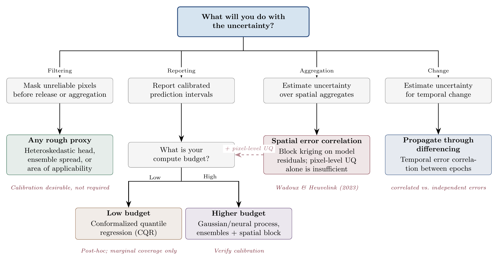

The total uncertainty in a map prediction arises from multiple, largely independent sources that are usefully organised into the classical distinction between aleatoric uncertainty (irreducible noise inherent in the data) and epistemic uncertainty (reducible uncertainty arising from limited knowledge) [@derkiureghian2009aleatory]. In the context of EO-derived maps, however, this abstract distinction maps onto pipeline stages.

#### Upstream (input) uncertainty Every observation that enters the model carries errors introduced before any machine learning is applied. Sensor noise, imperfect atmospheric correction, cloud mask failures, co-registration errors between sensors, compositing artifacts, and BRDF effects all contribute. These sources are predominantly aleatoric at the pixel level though the magnitude of the noise varies spatially (e.g., atmospheric correction is harder over bright surfaces) and can therefore appear epistemic at the map level. In principle, one would propagate input uncertainty through the model via Monte Carlo simulation over perturbed inputs [@heuvelink1998error]. In practice, this is rarely done since the computational cost is substantial, and the input uncertainty distributions are themselves poorly characterized. Nevertheless, it is important to acknowledge that model-derived uncertainty is only one component of the total error.

#### Label (reference data) uncertainty The training targets are themselves uncertain. For example, GEDI footprint-level AGBD estimates carry uncertainty from allometric models and instrument noise [@Duncanson2022GEDI_AGB], national forest inventory plots carry measurement error and representativeness uncertainty, and crowdsourced labels carry annotator disagreement. Label noise is a form of aleatoric uncertainty that sets a floor on achievable prediction accuracy. Methods that assume noise-free labels, which are most standard loss functions, will conflate label noise with model error in their uncertainty estimates.

#### Model (epistemic) uncertainty This encompasses everything the model does not know such as gaps in the training data distribution, misspecification of the functional form, and sensitivity to hyperparameter choices. Model uncertainty is highest where the inference domain differs from the training domain, which is exactly the regime that matters for global maps, which inevitably extrapolate beyond the spatial and temporal extent of their training data.

Many UQ methods address only model uncertainty. The gap between what is quantified and what contributes to the total error budget should be made explicit.

Unfortunately no method is simultaneously cheap, scalable, and well-calibrated. Gaussian Processes are calibrated (if the kernel is correct) but do not scale. Ensembles scale but are expensive and miscalibrated for spatial data. Conformal methods are cheap but provide only marginal coverage. Neural processes offer a favorable tradeoff but require bespoke architectures. Heteroskedastic regression is cheap and scalable but captures only aleatoric uncertainty.

The appropriate choice depends on what will be done with the uncertainty. If the goal is to mask out unreliable regions, even a rough uncertainty proxy may suffice. If the goal is to produce calibrated prediction intervals for carbon accounting, the requirements are stringent and the cost is correspondingly higher. If the goal is to report aggregate uncertainty over administrative units, the dominant concern is spatial error correlation (Section [Spatial Structure of Uncertainty](uq_spatial.qmd)), and no pixel-level UQ method alone will suffice. Users should articulate the intended use of uncertainty before choosing a method, not after. Figure @fig-uq-flowchart summarizes the decision logic discussed in the sections that follow.

{#fig-uq-flowchart}
